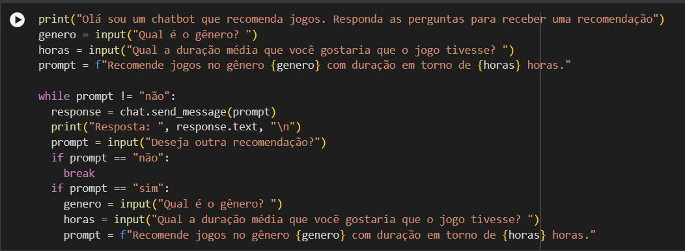
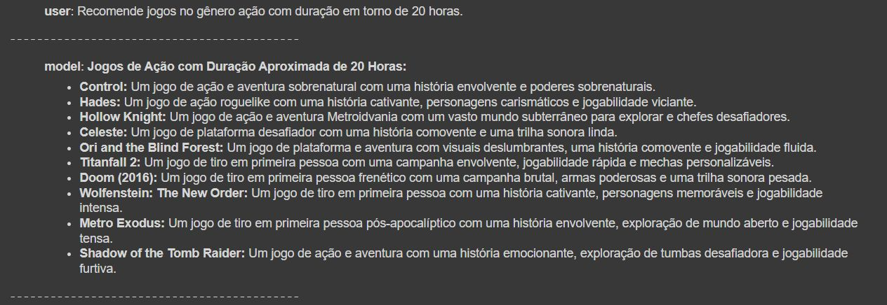

## Chatbot para games
Este projeto foi criado na imersão IA da Alura.

## Funcionalidades
- Consome a API Gemini da Google
- Recomenda jogos baseados em gênero e duração

## Como usar
1 - Executar cada bloco de código clicando no botão a esquerda.  
2 - No bloco com input responda as perguntas.

## Tecnologias utilizadas
- API Gemini da Google
- Python
- Jupter Notebook
